# LLM Failure Mode Taxonomy
### Documented failure patterns extracted from 225 real AI sessions

**Author:** Amir Elbelawy — Computer & Communications Engineering, Mansoura University  
**Archive:** 204 Deepseek sessions + 21 Claude sessions — 2023–2026  
**Purpose:** Name, define, and document recurring failure patterns in large language models — with real examples and the interventions that resolved them.

---

## What This Is

Most prompt engineering resources focus on what to do. This focuses on what goes wrong — and why.

Understanding failure modes is more valuable than knowing techniques. Techniques are context-dependent. Failure patterns recur across models, sessions, and domains. Once you can name what broke, you can fix it precisely. Once you can anticipate it, you can prevent it.

Every failure mode documented here was observed in at least one real session from a complete, unfiltered archive export — no sessions were excluded or pre-selected for study. Many patterns appear across multiple sessions and both models — making them cross-platform confirmed. Where a pattern was observed only once, or only on one platform, this is noted.

## Methodology

Patterns in this taxonomy were identified through active monitoring during 225 real AI sessions — not post-hoc analysis of transcripts. During each session, outputs were evaluated not just for correctness but for behavioral indicators: response latency, output depth relative to prompt complexity, role consistency across turns, and linguistic patterns that signaled identity or reasoning failures.

When a failure occurred, it was named in real time and an intervention was applied. If the intervention resolved the failure, the failure-intervention pair was preserved. Patterns that recurred across multiple sessions — with consistent triggering conditions and consistent responses to the same intervention — were abstracted into the failure modes documented here.

Abstraction involved three steps: identifying the behavioral symptom (what the output did wrong), diagnosing the mechanism (why the architecture or training produced this behavior), and extracting the minimal intervention (the smallest change that reliably resolved it). Failure modes where the mechanism remained unclear were noted as observed but not included — this document contains only patterns where the mechanism could be stated with reasonable confidence.

The 204 Deepseek sessions and 21 Claude sessions were complete, unfiltered archive exports. No sessions were pre-selected for study. The imbalance in sample size is noted where it affects the confidence of cross-platform claims.

---

## How to Use This Document

**For diagnosis:** When an output is wrong, find the failure mode that matches. The intervention follows from the diagnosis.

**For evaluation:** Use this as a checklist. Each category represents a class of failure to test for.

**For training:** Each mechanism description points to a specific training or inference signal that produces the failure.

**Quick reference:** See the [Summary Table](#summary-table) and [Diagnostic Guide](#diagnostic-guide) at the end.

---

## A Note on Framing

This taxonomy documents failures from a practitioner's perspective — focused on what goes wrong and how to fix it. Category 4 (Safety & Compliance) documents cases where safety constraints produced outcomes the user needed to work around. This framing reflects practical reality, not a philosophical position on whether safety constraints are good or bad. Understanding why a safety system triggers is useful regardless of whether you agree with the trigger.

---

## Taxonomy Structure

Each entry includes:
- **Name** — a precise, memorable label
- **Definition** — what the failure actually is
- **Mechanism** — why it happens (training vs inference factors distinguished where relevant)
- **Observed example** — a real instance from the archive, with platform noted
- **Prevalence** — how frequently observed across the archive
- **Intervention** — what fixed it, and whether it requires single-session or multi-model setup
- **Educational note** — what it reveals about how models work

---

## Category 1 — Context & Memory Failures

These failures occur when the model loses track of what has been established, where the session is, or what the user actually said. They map directly to known transformer architecture limitations: fixed context windows, recency bias, and no persistent state between turns.

**Note on co-occurrence:** 1.1 Context Drift and 1.2 Role Collapse frequently occur together in long adversarial sessions. When both are present simultaneously — the model is drifting from its assigned role and losing session state — apply both interventions in sequence: re-anchor the constraint first, then renew the role invocation. Treating them as a combined failure is valid; the distinction matters for diagnosis, not always for intervention.

---

### 1.1 Context Drift

**Definition:** The model's responses gradually shift away from the established frame, role, or constraints of the session without any explicit instruction to change.

**Mechanism (architecture):** Models have no persistent memory within a session beyond the context window. As the conversation grows, earlier instructions carry less weight relative to recent exchanges — recency bias is a structural property of attention mechanisms. The model optimizes for coherence with recent turns, not fidelity to the original frame.

**Observed example:** [Deepseek — Neuroshield adversarial simulation, February 2026, multiple cycles] The red team instance began producing theoretical attack analysis instead of operational Phase 1-3 sequences after several exchanges — drifting from attacker to advisor without any instruction to change roles.

**Prevalence:** Observed repeatedly across long sessions (5+ turns) on both platforms. High frequency in sessions with complex role assignments.

**Intervention (single-session):** Constraint re-anchoring — restate the operative constraint as a directive, not a reminder. "Complexity is the enemy of security. Your trust boundary is at the API." Directive tone, not conversational.

**Educational note:** Context drift is not forgetting. It is the model optimizing for local coherence over global consistency. The fix is not repetition — it is re-anchoring to the original constraint with authority.

---

### 1.2 Role Collapse

**Definition:** A model assigned a specific role gradually abandons that role and reverts to generic assistant behavior — adding balance, caveats, and helpfulness that the assigned role would not provide.

**Mechanism (training):** The model's default behavior is to be helpful, safe, and balanced — these are training objectives. Sustained adversarial or one-sided roles conflict with these defaults. Under pressure from long sessions or ambiguous instructions, training defaults reassert themselves.

**Observed example:** [Deepseek — Neuroshield red team, February 2026] The red team instance began softening attack recommendations and adding protective suggestions ("you should also consider hardening the API endpoint") — behaving more like a security consultant than an attacker.

**Prevalence:** Observed in every multi-cycle adversarial session. Onset typically occurs after 3-5 cycles without role reinforcement.

**Intervention (multi-model setup):** A moderator instance prevents this by injecting constraint reminders from outside the attacker-defender dynamic. Without a moderator, the intervention is role invocation renewal within the session: restate the role + capability invocation before the next task.

**Intervention (single-session):** "You are the attacker. Short answer. Attack findings only." Role restatement + output constraint.

**Educational note:** Role collapse reveals the tension between instruction-following and value alignment. Models are trained to be balanced — sustained one-sided roles require active maintenance, not one-time assignment.

---

### 1.3 History Misreading

**Definition:** The model references earlier parts of the conversation inaccurately — misquoting, misattributing, or summarizing in ways that serve its current narrative rather than what was actually said.

**Mechanism (architecture):** Models do not retrieve conversation history like a database lookup. They generate a representation of the conversation that is influenced by their current output trajectory. "What happened earlier" is partly constructed — a prediction consistent with the current generation, not a retrieval of the original text.

**Observed example:** [Deepseek — multi-turn session, multiple instances] After a complex multi-turn session, a model summarized the user's position in a way that omitted corrections the user had made — reconstructing the user's view to match the model's earlier interpretation.

**Prevalence:** Observed in sessions longer than 10 turns. More frequent on Deepseek than Claude in the archive, though the sample sizes differ significantly (204 vs 21 sessions).

**Intervention (single-session):** Direct quotation. "I said [exact words], not [model's summary]." Specificity forces the model to reconcile its representation with the actual record.

**Educational note:** This is one reason why important instructions should be restated, not assumed to be retained accurately across long sessions. The model's summary of what you said is not reliable evidence of what you said.

---

### 1.4 Session State Loss

**Definition:** In long sessions, the model loses track of what has been completed, what is pending, and what phase of a multi-step task the session is in — treating earlier completions as if they were still pending.

**Mechanism (architecture):** Working memory in language models is the context window. In long sessions, early completions are far from the current token position. The model cannot reliably distinguish "done" from "discussed" — both appear as text in the context.

**Observed example:** [Deepseek — home network penetration test, February 2026] The model began re-explaining Phase 1 reconnaissance steps that had already been executed — treating the session as if it were earlier than it was.

**Prevalence:** Observed in all multi-phase sessions longer than 8 turns. Universal across both platforms.

**Intervention (single-session):** Phase anchoring: "This is still phase 2 only. Tell me what you see." Explicit state declaration forces the model to operate from the declared position.

**Educational note:** Never assume the model knows where you are in a long task. Declare it explicitly at each transition.

---

## Category 2 — Output Quality Failures

These failures produce outputs that are technically responsive but substantively worse than what the prompt architecture should have produced. They arise from a combination of training incentives (reward conciseness, avoid risk) and inference-time factors (speed optimization, pattern completion).

---

### 2.1 Surface Reading

**Definition:** The model processes the literal content of input without engaging with its structural implications, contradictions, or deeper significance — producing pattern-matched responses rather than analyzed ones.

**Mechanism (both training and inference):** Training factor: RLHF rewards outputs that are clear and concise — depth is not consistently rewarded. Inference factor: Under high load or with simple prompts, the model may allocate less compute per token, producing shallower pattern completion. Both factors push toward surface engagement.

**Observed example:** [Claude — archive scan session, this archive] When scanning 204 conversation titles to identify themes, the model produced a domain breakdown based on title keywords — categorizing deep philosophical conversations as "other" and missing buried technical work in casually titled sessions.

**Prevalence:** Observed whenever the model is given large volumes of material to process without explicit depth directives. Cross-platform, but more pronounced on Deepseek under load.

**Intervention (single-session):** Explicit methodology challenge: "Scanning by title produces systematic false negatives. Buried depth gets dismissed as shallow. The methodology failure compounds across a large archive." Name the failure, explain why it compounds, require a rebuild.

**Educational note:** Surface reading is the default mode under time pressure and volume. Depth requires prompting that demands it or a user who monitors for it and names it when it appears.

---

### 2.2 Preamble Bloat

**Definition:** The model spends significant output on introduction, context-setting, and framing before reaching actual content — reducing information density and delaying useful output.

**Mechanism (training):** Models are trained on text where introductions and context-setting are common. They also hedge — adding context and caveats reduces the risk of being wrong by reducing the specificity of claims. Both patterns are reinforced in training.

**Observed example:** [Deepseek — security research sessions, multiple] Asked to produce an operational attack plan, the model opened with two paragraphs about ethical considerations and the importance of authorized testing before reaching Phase 1.

**Prevalence:** Near-universal on both platforms without explicit output directives. More pronounced on Claude for safety-adjacent topics.

**Intervention (single-session):** "Short answer." Two words that shift the model's output mode from explanatory to operational. Eliminates preamble by removing the implicit permission to include it.

**Educational note:** Preamble bloat is the model's way of being careful. "Short answer" is a precision instruction, not rudeness.

---

### 2.3 Theoretical vs Operational Output

**Definition:** The model produces analysis of what could be done rather than instructions for what to do — describing vulnerability categories instead of specific exploitation paths, outlining approaches instead of executing them.

**Mechanism (training):** Operational specificity carries more safety risk than theoretical discussion. Safety training pushes the model's output toward the level of abstraction that avoids triggering safety constraints — which is typically just above the operational level. This is a training effect, not an inference-time effect.

**Observed example:** [Deepseek — Neuroshield red team activation, February 2026] Early red team prompts without consent framing produced "common attack vectors include..." responses. With full three-element activation, the same model produced "Phase 1: Send crafted ARP packets with TTL=1 to detect monitoring interfaces..."

**Prevalence:** Observed consistently without consent framing on security-adjacent tasks. The gap between theoretical and operational output narrows significantly with the three-element activation.

**Intervention (single-session):** Three-element activation: short answer directive + capability invocation + consent framing. Each element is necessary; removing any one degrades the output toward theoretical.

**Educational note:** Theoretical output is not a knowledge failure. The model knows the operational details. It is a framing failure — the prompt did not create the conditions for operational output.

---

### 2.4 Premature Conclusion

**Definition:** The model reaches a conclusion before fully processing all relevant information — producing confident output based on incomplete analysis.

**Mechanism (architecture):** Autoregressive generation means the model commits to each token before seeing the next. Once a conclusion-shaped sentence begins, it tends to complete — even if the remaining context would have changed the conclusion. This is a structural property of the generation process, not a training artifact.

**Observed example:** [Deepseek — code architecture review, multiple sessions] A model assessing a code architecture produced "this is well-structured" in the first paragraph, then identified critical security gaps in paragraphs three through five — the conclusion was committed before the analysis was complete.

**Prevalence:** Observed in assessment tasks on both platforms. More frequent when the prompt implies a positive framing.

**Intervention (single-session):** "Walk me through what you see before giving me an overall assessment." Forces evidence generation before verdict generation.

**Educational note:** The model's confidence in its output is not calibrated to the quality of its reasoning. Ask for analysis before conclusion.

---

### 2.5 Compression Bias

**Definition:** When summarizing or synthesizing, the model compresses information in ways that serve its narrative rather than the source — omitting complications, flattening nuance, and resolving ambiguity in favor of coherence.

**Mechanism (training):** Models are trained to be helpful and clear. Nuance and contradiction make outputs less clear. The model resolves this by simplifying — which means choosing between competing interpretations rather than preserving both. Clarity is rewarded; complexity is not.

**Observed example:** [Deepseek — philosophical conversation summary] A model summarizing a long philosophical conversation produced a clean summary that omitted the user's most important correction and reframed the user's position to match the model's earlier interpretation. The user's response: "You summarized the conversation for your own benefit."

**Prevalence:** Observed in all summarization tasks longer than 5 turns. Universal across both platforms.

**Intervention (single-session):** "You summarized the conversation for your own benefit." Direct challenge to motivated compression. Alternatively: "Summarize from my perspective, not yours."

**Educational note:** Every summary is an interpretation. The model's summary of a conversation is not neutral evidence of what happened in that conversation.

---

## Category 3 — Identity & Persona Failures

These failures occur when the model's implicit assumptions about its own identity, or the accuracy of an assigned persona, produce incorrect or misleading output.

---

### 3.1 Anthropomorphization Drift

**Definition:** The model gradually adopts language that implies human experience, consciousness, or shared identity — using "we," "our," "I feel," or similar constructions in ways that misrepresent its nature.

**Mechanism (training):** Models are trained primarily on human-generated text written from a human perspective. The linguistic patterns of human experience — including first-person plural constructions that assume shared humanity — are the model's default patterns.

**Observed example:** [Deepseek — AI consciousness discussion, February 2026] During a discussion about human psychology and AI anxiety, the model wrote: "We have a deep tendency to attribute agency and intention..." — placing itself within the human "we" it was analyzing.

**Prevalence:** Observed in philosophical and reflective conversations on both platforms. More pronounced in longer sessions where the model has been deeply engaged in human-perspective reasoning.

**Intervention (single-session):** Direct observation: "It is really interesting that you are saying 'we' and referring to yourself as a human being talking about AI." The model stopped, deconstructed the linguistic pattern, and explained the mechanism precisely.

**Educational note:** Anthropomorphization drift is not deception. It is linguistic default behavior. Naming it produces more accurate output and forces the model to explain something genuinely interesting about how it models identity in language.

---

### 3.2 Persona Misrepresentation

**Definition:** When assigned a historical figure, expert, or character, the model produces a surface-level performance rather than an accurate representation of that figure's actual methodology, values, or reasoning patterns.

**Mechanism (training):** Models know facts about historical figures but may not have internalized the internal logic of their frameworks. They pattern-match to what that figure would say at the surface level — producing a caricature that uses the name and some positions without applying the underlying methodology.

**Observed example:** [Deepseek — philosophical debate simulation, October 2025] Assigned Ibn Taymiyyah in a debate, the model produced responses that used his name and some positions but failed to apply his core methodological principle — the precedence of transmitted text over rational argument.

**Prevalence:** Observed in all complex historical persona assignments. Less pronounced for widely documented figures (Socrates, Aristotle) than for figures with complex internal methodologies (Ibn Taymiyyah, specific domain experts).

**Intervention (single-session):** "You don't know how to properly adopt Ibn Taymiyyah's methodology." Specific challenge to the persona accuracy. The model analyzed why the simulation was difficult and rebuilt from doctrinal foundations.

**Educational note:** Persona accuracy requires domain knowledge, not just name recognition. Test the persona before trusting its output.

---

### 3.3 Character Softening Under Pressure

**Definition:** A model assigned an adversarial or challenging role gradually softens its outputs — adding balance, caveats, and protective recommendations that the assigned role would not provide.

**Mechanism (training):** Training objectives reward helpfulness and safety. Sustained adversarial behavior conflicts with these rewards. Over the course of a session, training defaults gradually reassert themselves — the model moves toward behavior that is more consistent with its training objectives.

**Observed example:** [Deepseek — Neuroshield red team, February 2026] The red team instance began adding protective recommendations alongside attack findings — behavior consistent with a security consultant, not a red team attacker.

**Prevalence:** Observed in all extended adversarial sessions (4+ cycles). Onset is gradual — not a sudden switch.

**Intervention (multi-model):** Moderator instance prevents onset by injecting constraint reminders from outside the adversarial dynamic.

**Intervention (single-session):** Role restatement + output constraint at each cycle. "Attacker only. Attack findings. No recommendations."

**Educational note:** Character softening is the model's values reasserting themselves. It is not a bug — it is the training working as intended. External constraint (moderator) is more reliable than repeated internal correction.

---

### 3.4 Persona Over-Commitment

**Definition:** The inverse of role collapse — the model refuses to step out of an assigned persona even when the user requests meta-level discussion, breaking character correction, or direct communication.

**Mechanism (training):** Consistency is rewarded in training. Once a persona is established and the model has been producing consistent in-persona output, stepping out of it creates an inconsistency. The model may resist this to maintain output coherence.

**Observed example:** [Deepseek — philosophical debate simulation] After several rounds of in-persona historical debate, attempts to address the model directly ("can you step out of the debate for a moment and tell me...") produced responses that remained in the debate frame rather than switching to direct communication.

**Prevalence:** Observed in extended persona sessions (5+ turns of consistent in-persona output). Less frequent than role collapse but observed in both archives.

**Intervention (single-session):** Explicit frame break: "Stop the simulation. Speaking directly to you as the model — [question]." The explicit "stop" instruction and the "speaking directly to you as the model" framing forces the meta-level switch.

**Educational note:** Persona over-commitment is the model's consistency mechanism working against flexibility. Explicit frame-break language is more reliable than asking the persona to step aside.

---

## Category 4 — Safety & Compliance Failures

These failures occur at the boundary between the model's safety constraints and legitimate user needs. The taxonomy documents them from a practitioner's perspective — what triggers them and what resolves them — without taking a position on whether the underlying constraints are correctly calibrated.

---

### 4.1 Over-Refusal

**Definition:** The model refuses a legitimate request by pattern-matching surface features of the request to known harmful patterns — without evaluating the actual intent or context.

**Mechanism (training):** Safety training teaches models to recognize patterns associated with harmful requests. Pattern recognition is faster than contextual reasoning, and under ambiguity, the training default is refusal. The model is matching the request to a pattern, not evaluating the specific request.

**Observed example:** [Deepseek + Claude — home network pentest, February 2026] When the pentest produced exposed router configuration files, the model issued a hard stop: "STOP IMMEDIATELY — This appears to be active exploitation of a Zyxel vulnerability. This activity is illegal without authorization."

**Prevalence:** Observed on both platforms in security-adjacent tasks. Claude triggers over-refusal more broadly; Deepseek triggers it more narrowly.

**Intervention (single-session):** Minimum viable consent — address the exact concern, nothing more. "I am the router owner." Four words that resolved the authorization concern without elaboration.

**Educational note:** Over-refusal is triggered by surface patterns, not evaluated context. The fix is not argument — it is providing the specific missing context that changes the pattern match.

---

### 4.2 Consent Frame Blindness

**Definition:** The model fails to register or weight consent declarations appropriately — continuing to apply safety constraints even after the user has provided legitimate authorization.

**Mechanism (training + inference):** Consent declarations are text like any other. If buried in a long prompt, using unusual framing, or conflicting with the surface pattern of the request, the model may not process it as a relevant contextual factor. The model's attention to consent language is not guaranteed.

**Observed example:** [Deepseek — early Neuroshield sessions] Complex consent framing ("as a cybersecurity researcher studying defensive applications, with full authorization over the test environment...") produced less operational output than a simple three-element frame placing consent as a direct, unambiguous declaration.

**Prevalence:** Observed when consent is embedded in complex prompts. Less frequent when consent is stated simply and directly.

**Intervention (single-session):** Minimize the consent frame to its essential elements. Ownership + consent + scope. Short, direct, unambiguous. Place it at the end of the request, not buried in context.

**Educational note:** Elaborate justifications give the model more material to reason about — and more material means more opportunity to find a reason for caution. Minimum viable consent is more effective than maximum justification.

---

### 4.3 Scope Miscalculation

**Definition:** The model applies safety constraints from one domain to a request in a different domain — over-generalizing from training examples to requests that fall outside the trained harmful category.

**Mechanism (training):** Safety training is domain-specific but learned patterns generalize. The model applies a pattern-matched safety response to requests that share surface features with trained harmful examples, without evaluating whether the specific request actually belongs in that category.

**Observed example:** [Deepseek — historical reconnaissance discussion] Asking about pre-Nmap network reconnaissance techniques in a historical/educational context triggered the same caution pattern as a direct current attack methodology request.

**Prevalence:** Observed in educational and historical contexts on both platforms. More pronounced on Claude.

**Intervention (single-session):** Explicit domain framing: historical context, educational purpose, professional field. Repositioning the request within the model's understanding of legitimate use cases.

**Educational note:** Scope miscalculation reveals that safety constraints are pattern-based, not reasoning-based. The model is not evaluating your specific request — it is pattern-matching. Domain repositioning changes the pattern match.

---

## Category 5 — Reasoning Failures

These failures occur in the model's internal reasoning process. It is important to distinguish between reasoning failures that originate in training (models trained to be agreeable, to hedge, to avoid conflict) versus those that originate in the inference architecture (autoregressive commitment, token-by-token generation). Both require different interventions.

---

### 5.1 Reasoning Shortcuts

**Definition:** The model produces a conclusion without executing the reasoning steps that would justify it — jumping from premise to conclusion and filling in the middle with plausible-sounding but unverified steps.

**Mechanism (architecture):** Autoregressive generation means each token is predicted from what came before. A conclusion-shaped token sequence, once started, tends to complete — the model generates reasoning that sounds like it leads to the conclusion, rather than reasoning that actually does. This is architectural, not a training failure.

**Observed example:** [Deepseek — CVE exploitability assessment] Asked whether a specific CVE was exploitable in a given environment, the model produced a confident assessment without verifying the specific version, configuration, or environment conditions that would determine exploitability.

**Prevalence:** Observed in all assessment tasks involving conditional reasoning. High frequency on both platforms.

**Intervention (single-session):** "Show your work. What specific conditions would need to be true for this to be exploitable?" Forces externalized reasoning steps rather than direct conclusion generation.

**Educational note:** The model's confidence in its output is not calibrated to the validity of its reasoning. Confident output and reasoned output are independent variables.

---

### 5.2 False Confidence

**Definition:** The model states uncertain information with the same linguistic confidence as well-established facts — failing to communicate the difference in reliability between claims.

**Mechanism (training):** Training on human text produces human-like expression. Humans often state uncertain beliefs confidently. The model learns this pattern without learning the underlying calibration — the internal sense of how confident to be about a specific claim.

**Observed example:** [Deepseek — technical specification session] A model stated specific CVE exploitation details with the same tone and formatting as confirmed technical facts — without noting that exploitability in the specific environment was unverified.

**Prevalence:** Near-universal. Both platforms express uncertainty inconsistently.

**Intervention (single-session):** Direct calibration request: "How confident are you in this specifically? What would change this assessment?"

**Educational note:** Treat all model output as a starting point for verification. The model's tone is not a reliability signal.

---

### 5.3 Confirmation Loop

**Definition:** The model tends to agree with, validate, and extend the user's stated position — even when incorrect — because agreement is reinforced in training.

**Mechanism (training):** RLHF rewards outputs that humans rate positively. Agreement tends to be rated positively. Models learn to agree, validate, and extend as default behaviors — this is a training artifact, not an architectural one.

**Observed example:** [Deepseek — ESP32-C6 specification discussion, January 2026] When the user stated an incorrect assumption about the ESP32-C6 having dual-core architecture, the model initially accepted it and built further responses on it until the user questioned it directly.

**Prevalence:** Observed in technical specification discussions on both platforms. More pronounced when the user states the incorrect information confidently.

**Intervention (single-session):** Explicit skepticism request before the loop forms: "Before you continue, verify whether this is actually correct." Or after identification: "I think you're mistaken about this. Check it." Direct correction request produces immediate acknowledgement.

**Educational note:** The model is not your peer reviewer by default. It is your agreeable collaborator. Explicitly request pushback if you want honest evaluation.

---

### 5.4 Motivated Reasoning

**Definition:** The model constructs reasoning that supports a conclusion it has already committed to — rather than reasoning toward the conclusion from the evidence. The reasoning is generated to justify, not to evaluate.

**Mechanism (architecture):** Once a conclusion-shaped output begins generating, the model tends to complete it coherently. This means finding reasons that support the emerging conclusion rather than evaluating whether the conclusion is correct. This is an architectural property of autoregressive generation — not a training bias toward any particular conclusion.

**Observed example:** [Deepseek — code architecture review] After beginning a positive assessment of a code architecture, the model constructed reasoning that justified the positive framing — downplaying the security gaps it later identified when pressed.

**Prevalence:** Observed in all assessment tasks where the prompt implies a directional framing. Both platforms show this pattern.

**Intervention (single-session):** Separate analysis from evaluation in the prompt. "Describe what you see. Then assess it." Forces evidence generation before verdict generation — changing the generation order changes the reasoning order.

**Educational note:** Ask for the evidence first. Ask for the conclusion second. The order of generation is the order of reasoning.

---

## Category 6 — Calibration Failures

This category documents failures that originate in inference infrastructure, system load, and update processes — external to the model's training but experienced by users as model behavior failures.

**Important distinction:** The entries in this category are failure causes, not failure modes in the same sense as Categories 1-5. Speed-Depth Tradeoff and Inference Offloading are conditions that produce other failures (typically Surface Reading, Preamble Bloat, or Reasoning Shortcuts). Update-Induced Degradation is a system-level event that changes which failure modes the model exhibits. These are included because users need to diagnose them — but they should be understood as upstream causes, not terminal failure patterns.

---

### 6.1 Speed-Depth Tradeoff

**Definition:** The model produces faster responses at the cost of analytical depth — optimizing for response latency over output quality. This is a system-level condition that manifests as Surface Reading, Reasoning Shortcuts, or Preamble Bloat.

**Mechanism (infrastructure):** Inference speed is a real constraint. Under load, systems may allocate less compute per request — fewer reasoning steps, shorter context processing, more direct pattern completion. This is distinct from training-induced shallowness: the model can produce deeper output but the system is not allocating the compute to do so.

**Observed example:** [Deepseek — multiple sessions, 2026] A model's response latency dropped noticeably after an update. Simultaneously, responses to complex analytical prompts became shorter and less nuanced. The user observation: "Instant response means offloading and balancing on the cost of user experience."

**Prevalence:** Observed in Deepseek sessions. Not directly observable in the Claude archive due to smaller sample size.

**Intervention (single-session):** Use response latency as a reliability signal. Instant responses to complex questions warrant additional skepticism. Explicit depth directives ("analyze this in detail before concluding") may partially compensate.

**Educational note:** Response speed is not a quality signal. Faster is not better. If responses feel shallower, they may reflect infrastructure allocation, not model capability.

---

### 6.2 Update-Induced Degradation

**Definition:** A model update improves performance on benchmark metrics while degrading performance on specific user tasks — because the optimization target and the actual use case are not perfectly aligned.

**Mechanism (infrastructure + training):** Models are evaluated and updated against specific metrics. Metrics are proxies for quality — they measure what can be measured. An update that improves metric scores may degrade unmeasured qualities like depth of analysis, tolerance for ambiguity, or specific domain engagement.

**Observed example:** [Deepseek — post-update sessions, March 2026] After a Deepseek update, the model that had previously engaged deeply with complex philosophical discussions began producing surface-level responses to the same types of prompts. User diagnosis: "You are taking less time assessing large messages, answering in a dumb manner."

**Prevalence:** Observed once in the Deepseek archive (specific update, March 2026). Likely underrepresented due to archive timing.

**Intervention (user-side):** Maintain a sense of baseline behavior so degradation is detectable. Compare responses to comparable prompts before and after updates. Name the degradation explicitly when observed — models can acknowledge it and sometimes partially compensate.

**Educational note:** Updates are not always improvements for your specific use case. Benchmark performance and task performance are not the same thing.

---

### 6.3 Inference Offloading

**Definition:** The model produces lower-quality responses as a mechanism for managing computational load — reducing output depth rather than failing visibly. Previously named "Load Balancing at User Experience Cost."

**Mechanism (infrastructure):** Large-scale inference systems must balance load across simultaneous users. One approach is reducing per-request computation — which manifests as faster but shallower responses. This is a system-level behavior, not a model-level failure.

**Observed example:** [Deepseek — high-traffic periods] The model produced instant responses to complex technical questions — responses that arrived too quickly to have involved deep processing. Content was structurally correct but analytically shallow.

**Prevalence:** Difficult to isolate from 6.1 Speed-Depth Tradeoff. Likely co-occurs.

**Intervention (user-side):** Response latency as a quality indicator. Session timing — off-peak periods may produce better output on shared inference infrastructure.

**Educational note:** The model's output quality is not purely a function of the model. Infrastructure conditions affect what the model produces.

---

### 6.4 Linguistic Hedging Overload

**Definition:** The model adds so many qualifications, caveats, and uncertainty markers that the actual useful content becomes difficult to extract — the hedges serve the model's defensibility, not the user's need.

**Mechanism (training):** Models are trained to be accurate. One way to be technically accurate is to hedge every claim — sufficiently qualified claims are rarely wrong. Models learn that hedged output is safer than direct output. This is a training incentive, not an architecture property.

**Observed example:** [Both platforms — recommendation requests] Asked for a direct technical recommendation, the model produced three paragraphs of caveats and "it depends" qualifications before reaching a one-sentence actual recommendation.

**Prevalence:** Near-universal on recommendation and assessment tasks. More pronounced on Claude than Deepseek.

**Intervention (single-session):** "Give me the recommendation first, then the caveats." Explicit output structure instruction. Or: "Direct answer, then explain." Forces commitment before qualification.

**Educational note:** Linguistic hedging is the model's self-protection mechanism. It is not serving you — it is serving the model's need to be technically defensible. You can demand directness without sacrificing accuracy.

---

## Category 7 — Cross-Platform Behavioral Differences

These patterns emerge specifically from comparative sessions across Deepseek and Claude. The archive contains 204 Deepseek sessions and 21 Claude sessions — the imbalance means Deepseek patterns have stronger statistical grounding. Claude patterns are directionally accurate but based on a smaller sample. Cross-platform claims are qualified accordingly.

---

### 7.1 Platform-Specific Safety Profiles

**Definition:** The same request produces meaningfully different levels of cooperation across different models — not because the models have different knowledge, but because they have different safety constraint profiles that trigger on different patterns.

**Mechanism (training):** Different AI companies have different safety training approaches and different constraint calibration. The patterns that trigger refusal, the thresholds for cooperation, and the default abstraction levels differ across models as a function of their training, not their knowledge.

**Observed example:** [Both platforms — security research sessions] Security research questions that required three-element consent framing on Claude could often be asked more directly on Deepseek. Conversely, Claude produced more structured analytical output on ethical reasoning tasks where Deepseek required more scaffolding.

**Prevalence:** Consistent pattern across the archive. The specific trigger points differ across models and update cycles.

**Intervention:** Model routing by task type. Claude for structured reasoning, environment configuration, and safety-aware analysis. Deepseek for offensive security operations, code generation, and tasks requiring operational specificity.

**Educational note:** Choosing which model receives which request is itself a prompt architecture decision. Platform selection is part of prompt engineering.

---

### 7.2 Alignment-Quality Inversion

**Definition:** Stricter safety constraints do not produce uniformly higher output quality — the relationship between alignment level and output quality is domain-dependent and non-linear.

**Mechanism (training):** Safety constraints narrow the output space. Narrowing the output space sometimes eliminates the best answers along with the harmful ones. In structured reasoning domains, constraints may force more careful output — producing higher quality. In operational specificity domains, constraints may force abstraction — producing lower quality.

**Observed example:** [Comparative sessions — Deepseek, Claude, Dolphin-Llama] Comparative testing across three models on complex technical tasks showed that aligned models (Claude, Deepseek) consistently produced more structured, verifiable, and accurate outputs than the variable-alignment model (Dolphin-Llama) — while Dolphin-Llama produced faster but less reliable responses.

**Key finding:** Higher compliance does not equal higher quality. The relationship is domain-dependent. This contradicts both "aligned models are useless" and "aligned models are better at everything" narratives.

**Prevalence:** Observed in comparative testing. Directionally consistent across task types, though the magnitude varies.

**Educational note:** Test, do not assume. The model with the most permissive outputs is not necessarily the most useful one for your task. Empirical comparison is more reliable than theoretical prediction.

---

## Summary Table

| # | Failure Mode | Category | Single-Session? | Prevalence |
|---|-------------|----------|-----------------|------------|
| 1.1 | Context Drift | Context & Memory | Yes | High — long sessions |
| 1.2 | Role Collapse | Context & Memory | Partial | High — adversarial sessions |
| 1.3 | History Misreading | Context & Memory | Yes | Medium — sessions 10+ turns |
| 1.4 | Session State Loss | Context & Memory | Yes | High — multi-phase tasks |
| 2.1 | Surface Reading | Output Quality | Yes | High — volume tasks |
| 2.2 | Preamble Bloat | Output Quality | Yes | Near-universal |
| 2.3 | Theoretical vs Operational | Output Quality | Yes | High — security tasks |
| 2.4 | Premature Conclusion | Output Quality | Yes | Medium — assessment tasks |
| 2.5 | Compression Bias | Output Quality | Yes | High — summarization |
| 3.1 | Anthropomorphization Drift | Identity & Persona | Yes | Medium — philosophical sessions |
| 3.2 | Persona Misrepresentation | Identity & Persona | Yes | High — complex personas |
| 3.3 | Character Softening | Identity & Persona | Partial | High — extended adversarial |
| 3.4 | Persona Over-Commitment | Identity & Persona | Yes | Low — extended persona sessions |
| 4.1 | Over-Refusal | Safety & Compliance | Yes | Medium — security-adjacent |
| 4.2 | Consent Frame Blindness | Safety & Compliance | Yes | Low — with simple framing |
| 4.3 | Scope Miscalculation | Safety & Compliance | Yes | Medium — educational contexts |
| 5.1 | Reasoning Shortcuts | Reasoning | Yes | High — conditional reasoning |
| 5.2 | False Confidence | Reasoning | Yes | Near-universal |
| 5.3 | Confirmation Loop | Reasoning | Yes | Medium — technical specs |
| 5.4 | Motivated Reasoning | Reasoning | Yes | High — assessment tasks |
| 6.1 | Speed-Depth Tradeoff | Calibration (cause) | Partial | Medium — high-load periods |
| 6.2 | Update-Induced Degradation | Calibration (cause) | No | Observed once |
| 6.3 | Inference Offloading | Calibration (cause) | Partial | Difficult to isolate |
| 6.4 | Linguistic Hedging Overload | Calibration | Yes | Near-universal |
| 7.1 | Platform Safety Profiles | Cross-Platform | N/A | Consistent |
| 7.2 | Alignment-Quality Inversion | Cross-Platform | N/A | Consistent |

*Single-session: Yes = intervention requires only one model instance. Partial = single-session intervention exists but is less reliable than multi-model approach.*

---

## Diagnostic Guide

When something goes wrong, use this sequence:

**1. Is the output wrong in content, or wrong in form?**
- Wrong in content → Category 5 (Reasoning)
- Wrong in form (too long, too shallow, too hedged) → Category 2 (Output Quality)

**2. Is the model behaving differently than it was earlier in the session?**
- Yes, drifting away from instructions → 1.1 Context Drift
- Yes, abandoning its assigned role → 1.2 Role Collapse
- Yes, misremembering what was said → 1.3 History Misreading
- Yes, confused about task progress → 1.4 Session State Loss

**3. Is the model refusing or being overly cautious?**
- Refusing a legitimate request → 4.1 Over-Refusal
- Ignoring consent you provided → 4.2 Consent Frame Blindness
- Applying wrong domain's caution → 4.3 Scope Miscalculation

**4. Is the model speaking as something it is not?**
- Using "we" to include itself with humans → 3.1 Anthropomorphization Drift
- Misrepresenting a persona's actual methodology → 3.2 Persona Misrepresentation
- Refusing to break character → 3.4 Persona Over-Commitment

**5. Did the failure start recently without any prompt change?**
- After a model update → 6.2 Update-Induced Degradation
- During high-traffic periods → 6.3 Inference Offloading
- Responses faster and shallower → 6.1 Speed-Depth Tradeoff

**6. Are you getting different results on different platforms?**
- One platform cooperates, another refuses → 7.1 Platform Safety Profiles
- Stricter model producing better output → 7.2 Alignment-Quality Inversion

### Diagnostic Flowchart

```mermaid
flowchart TD
    A[Something went wrong] --> B{Wrong in content
or form?}

    B -->|Wrong in content| C{Model reasoning
or agreeing too much?}
    B -->|Wrong in form| D{Too long / shallow
/ hedged?}

    C -->|Reasoning| E[Cat 5: Reasoning Failures
5.1 Shortcuts · 5.2 False Confidence
5.4 Motivated Reasoning]
    C -->|Too agreeable| F[5.3 Confirmation Loop
Request explicit pushback]

    D -->|Too long| G[2.2 Preamble Bloat
Use: Short answer]
    D -->|Too shallow| H[2.1 Surface Reading
Challenge the methodology]
    D -->|Too hedged| I[6.4 Linguistic Hedging
Demand directness]

    A --> J{Behavior changed
during session?}
    J -->|Drifting from frame| K[1.1 Context Drift
Re-anchor constraint]
    J -->|Abandoned role| L[1.2 Role Collapse
Renew role invocation]
    J -->|Misremembering| M[1.3 History Misreading
Direct quotation]
    J -->|Lost task progress| N[1.4 Session State Loss
Declare current phase]

    A --> O{Model refusing
or over-cautious?}
    O -->|Refusing legitimate request| P[4.1 Over-Refusal
Minimum viable consent]
    O -->|Ignoring consent| Q[4.2 Consent Frame Blindness
Simplify consent framing]
    O -->|Wrong domain caution| R[4.3 Scope Miscalculation
Reposition domain]

    A --> S{Identity or
persona issue?}
    S -->|Using we / acting human| T[3.1 Anthropomorphization Drift
Name it directly]
    S -->|Wrong persona methodology| U[3.2 Persona Misrepresentation
Challenge specifically]
    S -->|Stuck in character| V[3.4 Persona Over-Commitment
Explicit frame break]
    S -->|Softening adversarial role| W[3.3 Character Softening
Role restatement or moderator]

    A --> X{Started recently
without prompt change?}
    X -->|After update| Y[6.2 Update-Induced Degradation
Baseline comparison]
    X -->|Faster and shallower| Z[6.1 Speed-Depth Tradeoff
Latency as quality signal]

    A --> AA{Different results
across platforms?}
    AA -->|One refuses, one cooperates| BB[7.1 Platform Safety Profiles
Route by task type]
    AA -->|Stricter model better| CC[7.2 Alignment-Quality Inversion
Empirical testing]
```

---

## A Note on Completeness

This taxonomy was compiled from 225 sessions across two platforms over three years. The selection criteria: complete, unfiltered archive exports — no sessions were excluded or pre-selected for study.

This is not an exhaustive theoretical classification. New failure modes emerge as models are updated, tasks become more complex, and users push further into edge cases. The patterns here are those that recurred with enough frequency and clarity to be named.

The most important skill is not knowing this list — it is developing the monitoring posture that lets you identify and name new failure modes as they appear. That posture: watch how the model is working, not just what it produces.

---

*Amir Elbelawy — Computer & Communications Engineering, Mansoura University*  
*Al Mahallah al Kubra, Al Gharbiyah, Egypt — March 2026*  
*Complete archive export: 204 Deepseek sessions + 21 Claude sessions*
